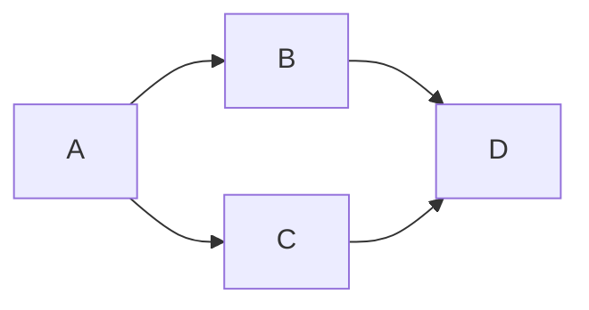
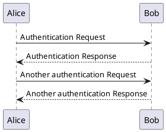
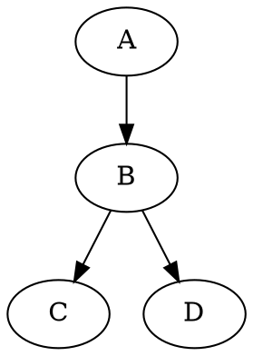

---
markdown:
  image_dir: /assets
  path: output.md
  ignore_from_front_matter: true
  absolute_image_path: false
---

# MPE

# 这是 <h1> 一级标题

## 这是 <h2> 二级标题

### 这是 <h3> 三级标题

#### 这是 <h4> 四级标题

##### 这是 <h5> 五级标题

###### 这是 <h6> 六级标题

# 这个标题拥有 1 个 id {#my_id}

# 这个标题有 2 个 classes {.class1 .class2}

*这会是 斜体 的文字*
*这会是 斜体 的文字*

**这会是 粗体 的文字**
**这会是 粗体 的文字**

_你也 **组合** 这些符号_

~~这个文字将会被横线删除~~

- Item 1
- Item 2
  - Item 2a
  - Item 2b

1. Item 1
1. Item 2
1. Item 3
   1. Item 3a
   1. Item 3b

<!--  -->


<!-- Format:  -->
Format: 

正如 Kanye West 所说：

> We're living the future so
> the present is our past.

如下，三个或者更多的

---

连字符

***

星号

___

下划线

我觉得你应该在这里使用
`<addr>` 才对。

```ruby
require 'redcarpet'
markdown = Redcarpet.new("Hello World!")
puts markdown.to_html
```

```javascript {.class1 .class}
function add(x, y) {
  return x + y
}
```

```javascript {.line-numbers}
function add(x, y) {
  return x + y
}
```

```javascript {highlight=10}
```

```javascript {highlight=10-20}
```

```javascript {highlight=[1-10,15,20-22]}
```

- [ ] @mentions, #refs, [links](http://baidu.com), **formatting**, and <del>tags</del> supported
- [ ] list syntax required (any unordered or ordered list supported)
- [ ] this is a complete item
- [ ] this is an incomplete item

| First Header                | Second Header                |
| --------------------------- | ---------------------------- |
| Content from cell 1         | Content from cell 2          |
| Content in the first column | Content in the second column |

First Header                | Second Header
--------------------------- | ----------------------------
Content from cell 1         | Content from cell 2
Content in the first column | Content in the second column

`enableExtendedTableSyntax`

colspan `>` or `empty cell`:

| a   | b   |
| --- | --- |
| >   | 1   |
| 2   |     |

rowspan:

| a   | b   |
| --- | --- |
| 1   | 2   |
| ^   | 4   |

[Emoji-Cheat-Sheet](https://github.com/ikatyang/emoji-cheat-sheet/blob/master)
:smile:
:fa-car:

30^th^

H~2~O

Content [^1]

[^1]: Hi! This is a footnote

*[HTML]: Hyper Text Markup Language
*[W3C]: World Wide Web Consortium
The HTML specification
is maintained by the W3C.

==marked==

```
添加 {++ ++}
删除 {-- --}
替换 {~~ ~> ~~}
注释 {>> <<}
高亮 {== ==}{>> <<}
```

Lorem ipsum dolor {++sit++} amet...
Lorem ipsum dolor <ins>sit</ins> amet…

Lorem{‐‐ ipsum‐‐} dolor sit amet…
Lorem<del> ipsum</del> dolor sit amet…

Lorem {~~hipsum~>ipsum~~} dolor sit amet…

Lorem <del>hipsum</del><ins>ipsum</ins> dolor sit amet…

Lorem ipsum dolor sit amet.{>>This is a comment<<}
Lorem ipsum dolor sit amet.<span class="critic comment">This is a comment</span>

Lorem ipsum dolor sit amet, consectetur adipiscing elit. {==Vestibulum at
orci magna. Phasellus augue justo, sodales eu pulvinar ac, vulputate eget
nulla.==}{>>confusing<<} Mauris massa sem, tempor sed cursus et, semper
tincidunt lacus.

Lorem ipsum dolor sit amet, consectetur adipiscing elit. <mark>Vestibulum at
orci magna. Phasellus augue justo, sodales eu pulvinar ac, vulputate eget
nulla.</mark><span class="critic metadata">confusing</span> Mauris massa
sem, tempor sed cursus et, semper tincidunt lacus.

## [Admonition](https://squidfunk.github.io/mkdocs-material/reference/admonitions/)

!!! note This is the admonition title
    This is the admonition body
  
!!! Abstract
!!! Info
!!! Tip
!!! Success
!!! Question
!!! Warning
!!! Failure
!!! Danger
!!! Bug
!!! Example
!!! Quote

# [Math](https://katex.org/docs/supported.html)

$f(x)=sin(x)+12$
$$f(x)=sin(x)+12$$

$\sum_{n=1}^{100} n $
$$\sum_{n=1}^{100} n $$
$ \delta \lambda $

# [Flow Charts](https://flowchart.js.org)

```flow
st=>start: Start:>http://www.google.com[blank]
e=>end:>http://www.google.com
op1=>operation: My Operation
sub1=>subroutine: My Subroutine
cond=>condition: Yes
or No?:>http://www.google.com
io=>inputoutput: catch something...
para=>parallel: parallel tasks

st->op1->cond
cond(yes)->io->e
cond(no)->para
para(path1, bottom)->sub1(right)->op1
para(path2, top)->op1
```

```flow
st=>start: Start|past:>http://www.google.com[blank]
e=>end: End|future:>http://www.google.com
op1=>operation: My Operation|past
op2=>operation: Stuff|current
sub1=>subroutine: My Subroutine|invalid
cond=>condition: Yes
or No?|approved:>http://www.google.com
c2=>condition: Good idea|rejected
io=>inputoutput: catch something...|future

st->op1(right)->cond
cond(yes, right)->c2
cond(no)->sub1(left)->op1
c2(yes)->io->e
c2(no)->op2->e
```

```flow
st=>start: Improve your
l10n process!
e=>end: Continue to have fun!:>https://youtu.be/YQryHo1iHb8[blank]
op1=>operation: Go to locize.com:>https://locize.com[blank]
sub1=>subroutine: Read the awesomeness
cond(align-next=no)=>condition: Interested to
getting started?
io=>inputoutput: Register:>https://www.locize.app/register[blank]
sub2=>subroutine: Read about improving
your localization workflow
or another source:>https://medium.com/@adrai/8-signs-you-should-improve-your-localization-process-3dc075d53998[blank]
op2=>operation: Login:>https://www.locize.app/login[blank]
cond2=>condition: valid password?
cond3=>condition: reset password?
op3=>operation: send email
sub3=>subroutine: Create a demo project
sub4=>subroutine: Start your real project
io2=>inputoutput: Subscribe

st->op1->sub1->cond
cond(yes)->io->op2->cond2
cond2(no)->cond3
cond3(no,bottom)->op2
cond3(yes)->op3
op3(right)->op2
cond2(yes)->sub3
sub3->sub4->io2->e
cond(no)->sub2(right)->op1

st@>op1({"stroke":"Red"})@>sub1({"stroke":"Red"})@>cond({"stroke":"Red"})@>io({"stroke":"Red"})@>op2({"stroke":"Red"})@>cond2({"stroke":"Red"})@>sub3({"stroke":"Red"})@>sub4({"stroke":"Red"})@>io2({"stroke":"Red"})@>e({"stroke":"Red","stroke-width":6,"arrow-end":"classic-wide-long"})
```

# [Sequence Diagrams](https://bramp.github.io/js-sequence-diagrams)

```sequence {theme="hand"}
Andrew->China: Says Hello
Note right of China: China thinks\nabout it
China-->Andrew: How are you?
Andrew->>China: I am good thanks!
```

```sequence {theme="simple"}
Andrew->China: Says Hello
Note right of China: China thinks\nabout it
China-->Andrew: How are you?
Andrew->>China: I am good thanks!
```

# [Mermaid](https://github.com/mermaid-js/mermaid)




# [PlantUML](https://plantuml.com/zh)




# [WaveDrom](https://wavedrom.com/tutorial.html)

```wavedrom
{ signal: [{ name: "Alfa", wave: "01.zx=ud.23.456789" }] }
```

```wavedrom
{ signal: [
  { name: "pclk", wave: 'p.......' },
  { name: "Pclk", wave: 'P.......' },
  { name: "nclk", wave: 'n.......' },
  { name: "Nclk", wave: 'N.......' },
  {},
  { name: 'clk0', wave: 'phnlPHNL' },
  { name: 'clk1', wave: 'xhlhLHl.' },
  { name: 'clk2', wave: 'hpHplnLn' },
  { name: 'clk3', wave: 'nhNhplPl' },
  { name: 'clk4', wave: 'xlh.L.Hx' },
]}
```

# [GraphViz](https://github.com/mdaines/viz.js)




# [Vega](https://vega.github.io/vega/) & [Vega-lite](https://vega.github.io/vega-lite/)

```vega
{
  "$schema": "https://vega.github.io/schema/vega/v5.json",
  "width": 400,
  "height": 200,
  "padding": 5,

  "data": [
    {
      "name": "table",
      "values": [
        {"category": "A", "amount": 28},
        {"category": "B", "amount": 55},
        {"category": "C", "amount": 43},
        {"category": "D", "amount": 91},
        {"category": "E", "amount": 81},
        {"category": "F", "amount": 53},
        {"category": "G", "amount": 19},
        {"category": "H", "amount": 87}
      ]
    }
  ],

  "signals": [
    {
      "name": "tooltip",
      "value": {},
      "on": [
        {"events": "rect:mouseover", "update": "datum"},
        {"events": "rect:mouseout",  "update": "{}"}
      ]
    }
  ],

  "scales": [
    {
      "name": "xscale",
      "type": "band",
      "domain": {"data": "table", "field": "category"},
      "range": "width",
      "padding": 0.05,
      "round": true
    },
    {
      "name": "yscale",
      "domain": {"data": "table", "field": "amount"},
      "nice": true,
      "range": "height"
    }
  ],

  "axes": [
    { "orient": "bottom", "scale": "xscale" },
    { "orient": "left", "scale": "yscale" }
  ],

  "marks": [
    {
      "type": "rect",
      "from": {"data":"table"},
      "encode": {
        "enter": {
          "x": {"scale": "xscale", "field": "category"},
          "width": {"scale": "xscale", "band": 1},
          "y": {"scale": "yscale", "field": "amount"},
          "y2": {"scale": "yscale", "value": 0}
        },
        "update": {
          "fill": {"value": "steelblue"}
        },
        "hover": {
          "fill": {"value": "red"}
        }
      }
    },
    {
      "type": "text",
      "encode": {
        "enter": {
          "align": {"value": "center"},
          "baseline": {"value": "bottom"},
          "fill": {"value": "#333"}
        },
        "update": {
          "x": {"scale": "xscale", "signal": "tooltip.category", "band": 0.5},
          "y": {"scale": "yscale", "signal": "tooltip.amount", "offset": -2},
          "text": {"signal": "tooltip.amount"},
          "fillOpacity": [
            {"test": "isNaN(tooltip.amount)", "value": 0},
            {"value": 1}
          ]
        }
      }
    }
  ]
}
```

```vega-lite
{
  "data": {
    "values": [
      {"a": "C", "b": 2}, {"a": "C", "b": 7}, {"a": "C", "b": 4},
      {"a": "D", "b": 1}, {"a": "D", "b": 2}, {"a": "D", "b": 6},
      {"a": "E", "b": 8}, {"a": "E", "b": 4}, {"a": "E", "b": 7}
    ]
  },
  "mark": "point",
  "encoding": {
    "x": {"field": "a", "type": "nominal"},
    "y": {"field": "b", "type": "quantitative"}
  }
}
```

# [Ditaa](https://github.com/stathissideris/ditaa)

```ditaa {cmd=true args=["-E"] }
+--------+   +-------+    +-------+
|        | --+ ditaa +--> |       |
|  Text  |   +-------+    |diagram|
|Document|   |!magic!|    |       |
|     {d}|   |       |    |       |
+---+----+   +-------+    +-------+
    :                         ^
    |       Lots of work      |
    +-------------------------+
```

# Tips


@import "../assets/tux.png"
@import "parser.md"
@import "base.html"

@import "mpe.lua" {cmd line_begin=0 line_end=10}

@import "mpe.js" {cmd="node" .line-numbers}

```bash {cmd}
ls .
```

```javascript {cmd="node"}
const date = Date.now()
console.log(date.toString())
```

```
pacman -S mingw-w64-x86_64-gnuplot
```

```gnuplot {cmd=true output="html"}
set terminal svg
set title "Simple Plots" font ",20"
set key left box
set samples 50
set style data points

plot [-10:10] sin(x),atan(x),cos(atan(x))
```

```gnuplot {cmd output:"html", id:"itgtulrs"}
# output svg
set terminal svg

set xlabel "x"
set ylabel "y"
set key top
set border 4095
set xrange [-15:15]
set yrange [-15:15]
set zrange [-0.25:1]
set samples 25
set isosamples 20
set title "pm3d demo.Radial sinc function.Default options."
set pm3d; set palette
#show pm3d
#show palette
splot sin(sqrt(x**2+y**2))/sqrt(x**2+y**2)
```

```
<!-- slide -->
  6666
<!-- slide -->
9999
```

```python {cmd}
# import os
# os.system('chcp 65001')
print("python3:hello world")
# help()
```
